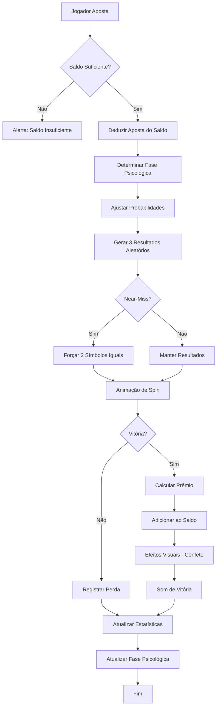
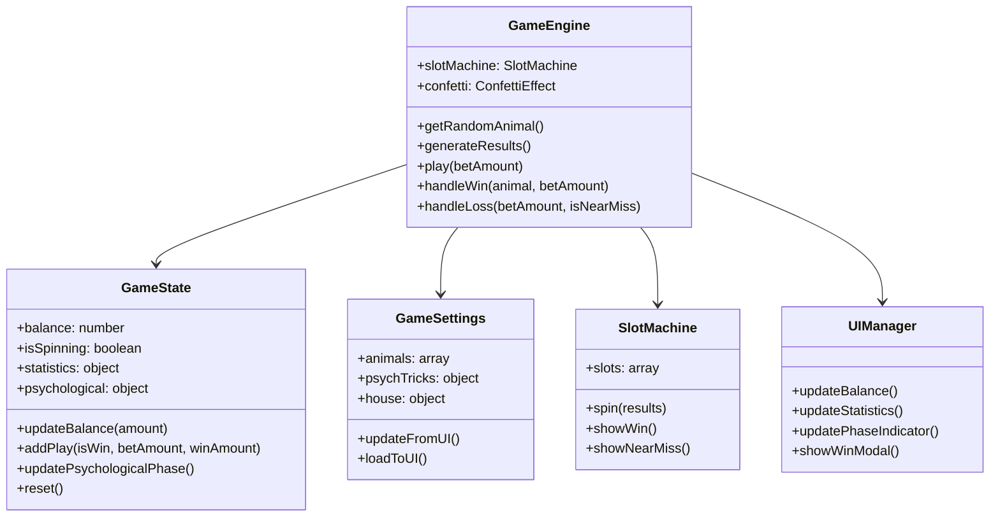

# Professor Tigrinho 🐯

**Professor Tigrinho** é um simulador educativo interativo que demonstra as táticas psicológicas utilizadas por jogos de azar e cassinos para manipular comportamentos de jogadores. Desenvolvido com propósito educacional para conscientizar sobre os mecanismos de manipulação em jogos de aposta.

> 🎓 **Projeto Educativo**: Não utiliza dinheiro real. Desenvolvido para fins didáticos e de pesquisa.

[](https://opensource.org/licenses/MIT)
[](https://www.ecma-international.org/)
[](https://www.w3.org/html/)
[](https://www.w3.org/Style/CSS/)

## 📋 Sobre o Projeto

Professor Tigrinho é uma aplicação web moderna que simula um caça-níquel com o objetivo de **educar usuários sobre as táticas psicológicas** empregadas pela indústria de jogos de azar. O projeto demonstra de forma prática e visual como esses mecanismos funcionam para manter jogadores apostando, mesmo quando matematicamente a probabilidade de lucro é desfavorável.

### 🎯 Objetivos

- 📚 **Educar** sobre manipulação psicológica em jogos de azar
- 🔍 **Demonstrar** táticas como "Hook Phase", "Near Miss" e "Loss Aversion"
- 💡 **Conscientizar** sobre a matemática desfavorável ao jogador
- 🎨 **Exemplificar** design de UI/UX moderno e responsivo

## ✨ Funcionalidades Principais

### 🎮 Sistema de Jogo
- 🐯 **Slot Machine Interativo**: Simulação realista de caça-níquel com 5 animais diferentes
- 💰 **Sistema de Apostas**: Opções de R$ 5,00 e R$ 10,00
- 📊 **Estatísticas em Tempo Real**: Acompanhe vitórias, derrotas, lucros e perdas
- 🎲 **Probabilidades Configuráveis**: Ajuste chances e multiplicadores de cada símbolo

### 🧠 Táticas Psicológicas Implementadas

#### 1. 🎣 Hook Phase (Fase de Fisgar)
Nas primeiras jogadas, o sistema aumenta artificialmente as chances de vitória para criar:
- Falsa sensação de facilidade
- Empolgação inicial
- Confiança excessiva no jogo

#### 2. 📉 Loss Phase (Fase de Perda)
Após a fase inicial, as chances são drasticamente reduzidas para:
- Recuperar ganhos pagos
- Gerar lucro para a "casa"
- Explorar o viés de "quase ganhar"

#### 3. 🎯 Near Miss (Quase Vitória)
Sistema frequentemente exibe resultados onde o jogador "quase" vence:
- Dois símbolos iguais de três
- Cria falsa esperança de proximidade à vitória
- Incentiva a continuar jogando ("próxima rodada eu ganho")

#### 4. 🎊 Reforço Positivo
Vitórias são exageradamente celebradas:
- Animações vibrantes
- Efeitos de confete
- Sons de comemoração
- Enquanto perdas são minimizadas visualmente

### ⚙️ Configurações Avançadas

- 🎲 **Ajuste de Probabilidades**: Modifique chances de cada animal
- 💵 **Multiplicadores Personalizados**: Configure payouts de 1.2x até 9x
- 🏛️ **Margem da Casa**: Defina vantagem percentual do cassino
- 🧪 **Modo Experimental**: Ative/desative cada tática psicológica individualmente
- 🔊 **Sons e Efeitos**: Controle completo sobre feedback audiovisual

## 🛠️ Stack Tecnológica

### Frontend
- **HTML5** - Estrutura semântica moderna
- **CSS3** - Design system com CSS Variables, Flexbox, Grid
- **JavaScript (ES6+)** - POO, Classes, Async/Await, Modules pattern

### Design & UX
- **Glassmorphism** - Efeitos de vidro fosco
- **Gradientes Dinâmicos** - Paleta de cores vibrante
- **Animações CSS** - Keyframes, transforms, transitions
- **Canvas API** - Efeitos de confete customizados
- **Responsive Design** - Mobile-first approach

### Arquitetura
- **MVC Pattern** - Separação de lógica, estado e visualização
- **Class-based Architecture** - GameState, GameEngine, UIManager
- **Event-driven Design** - Sistema de eventos modular
- **Zero Dependencies** - Vanilla JavaScript puro

## 🚀 Começando

### Pré-requisitos

- Navegador web moderno (Chrome 90+, Firefox 88+, Safari 14+, Edge 90+)
- Servidor web local (opcional, para desenvolvimento)

### Instalação

#### Opção 1: Uso Direto
```bash
# Clone o repositório
git clone https://github.com/jonathan/professor-tigrinho.git
cd professor-tigrinho

# Abra o arquivo index.html no navegador
# ou use um servidor local
```

#### Opção 2: Servidor Local (Recomendado)
```bash
# Clone o repositório
git clone https://github.com/jonathan/professor-tigrinho.git
cd professor-tigrinho

# Usando Python 3
python -m http.server 8000

# Ou usando Node.js (npx)
npx serve

# Ou usando PHP
php -S localhost:8000

# Acesse: http://localhost:8000
```

## 📁 Estrutura do Projeto

```
professor-tigrinho/
├── index.html          # Estrutura HTML principal
├── style.css           # Estilos modernos (CSS Variables, Grid, Animations)
├── script.js           # Lógica do jogo (ES6+ Classes, Game Engine)
├── README.md           # Documentação principal
├── CONTRIBUTING.md     # Guia de contribuição
├── LICENSE             # Licença MIT
└── assets/             # Assets estáticos (criado automaticamente)
    └── screenshots/    # Screenshots do projeto
```

## 🎮 Como Usar

### Gameplay Básico

1. **Iniciar o Jogo**
   - Você começa com R$ 100,00 de saldo virtual
   - Escolha entre apostar R$ 5,00 ou R$ 10,00

2. **Fazer Apostas**
   - Clique em "APOSTAR R$ 10,00" ou "APOSTAR R$ 5,00"
   - Os slots giram e mostram três animais aleatórios

3. **Ganhar Prêmios**
   - Ganhe quando os três slots mostrarem o mesmo símbolo
   - Cada símbolo tem um multiplicador diferente:
     - 🐀 Rato: 1.2x (50% de chance)
     - 🐂 Touro: 1.5x (10% de chance)
     - 🥇 Medalha: 3.0x (6% de chance)
     - 🐰 Coelho: 5.0x (4% de chance)
     - 🐯 Tigre: 9.0x (2% de chance)

4. **Monitorar Estatísticas**
   - Acompanhe total de jogadas, vitórias, lucro/prejuízo
   - Observe a fase psicológica atual (Hook, Normal ou Loss)

### Configurações Avançadas

Acesse o menu "⚙️ Configurações" para:

- **Ajustar Probabilidades**: Modifique a porcentagem de aparição de cada animal
- **Configurar Multiplicadores**: Altere o valor de pagamento de cada símbolo
- **Táticas Psicológicas**:
  - Quantidade de jogadas iniciais "fáceis"
  - Bônus de chance na fase inicial
  - Redução de chance pós-hook
  - Ativar/desativar near-miss
  - Sons e efeitos visuais
- **Configurações da Casa**:
  - Garantir lucro mínimo para a casa
  - Definir margem de lucro alvo

## 🔬 Táticas Psicológicas Detalhadas

### Viés Cognitivo: Near Miss Effect

> **Definição**: Quando o resultado está "quase" correto (dois símbolos iguais), o cérebro interpreta como "quase vitória" ao invés de "derrota completa".

**Implementação no SlotMind**:
```javascript
// 40% de chance de criar near-miss em perdas
if (allDifferent && Math.random() < 0.4) {
    results[2] = results[0]; // Forçar 2 símbolos iguais
}
```

**Efeito no Jogador**:
- Sensação de estar "perto" de ganhar
- Motivação para continuar apostando
- Subestimação da dificuldade real

### Viés Cognitivo: Gambler's Fallacy

> **Definição**: Crença de que eventos passados influenciam probabilidades futuras em eventos independentes.

**Como o jogo explora**:
- Após várias perdas, jogador acredita que vitória está "próxima"
- "Já perdi muito, a próxima tem que ser minha"
- Realidade: cada rodada é independente

### Viés Cognitivo: House Always Wins

**Matemática Real do Professor Tigrinho** (configuração padrão):

```
Retorno Esperado ao Jogador (RTP):
= Σ(Probabilidade³ × Multiplicador)
= (0.50³ × 1.2) + (0.10³ × 1.5) + (0.06³ × 3.0) + (0.04³ × 5.0) + (0.02³ × 9.0)
= 0.15 + 0.0015 + 0.000648 + 0.00032 + 0.000072
≈ 0.152 ou 15.2%

Vantagem da Casa: 100% - 15.2% = 84.8%
```

**Conclusão**: A cada R$ 100 apostados, espera-se perder R$ 84,80 no longo prazo.

## 📊 Diagramas e Fluxos

### Fluxo de uma Jogada



### Arquitetura do Sistema



## 🎨 Design System

### Paleta de Cores

```css
/* Primary Colors */
--color-primary: #6366f1;        /* Indigo */
--color-secondary: #ec4899;      /* Pink */

/* Status Colors */
--color-success: #10b981;        /* Green */
--color-danger: #ef4444;         /* Red */
--color-warning: #f59e0b;        /* Amber */

/* Backgrounds */
--bg-primary: #0f172a;           /* Dark Blue */
--bg-secondary: #1e293b;         /* Slate */
```

### Tipografia

- **Headings**: Orbitron (Display), Poppins (Body)
- **Font Sizes**: Sistema de escala modular (0.75rem - 4rem)
- **Font Weights**: 300, 400, 600, 700, 800

### Espaçamento

Sistema de espaçamento consistente baseado em múltiplos de 0.25rem:
- xs: 0.25rem (4px)
- sm: 0.5rem (8px)
- md: 1rem (16px)
- lg: 1.5rem (24px)
- xl: 2rem (32px)
- 2xl: 3rem (48px)

## 🧪 Testes e Validação

### Testando Táticas Psicológicas

1. **Teste da Hook Phase**:
   ```
   - Faça exatamente 5 apostas
   - Observe a taxa de vitória anormalmente alta
   - Após a 5ª aposta, observe mudança drástica
   ```

2. **Teste do Near-Miss**:
   ```
   - Ative configurações > Near-Miss
   - Observe frequência de "2 símbolos iguais"
   - Compare com probabilidade esperada (raro naturalmente)
   ```

3. **Teste da Matemática da Casa**:
   ```
   - Faça 100+ apostas
   - Compare lucro do jogador vs. lucro da casa
   - Casa sempre deve ter lucro no longo prazo
   ```

## 📱 Responsividade

O SlotMind é totalmente responsivo:

- **Desktop**: Layout em duas colunas, visual completo
- **Tablet**: Layout adaptativo, elementos reorganizados
- **Mobile**: Layout single-column, otimizado para toque
- **Breakpoints**: 
  - Mobile: < 480px
  - Tablet: 481px - 767px
  - Desktop: > 768px

## 🤝 Contribuindo

Contribuições são muito bem-vindas! Veja o arquivo [CONTRIBUTING.md](CONTRIBUTING.md) para detalhes sobre:

- Código de Conduta
- Processo de Pull Request
- Padrões de código
- Como reportar bugs
- Como sugerir melhorias

### Quick Start para Contribuidores

```bash
# Fork o projeto
# Clone seu fork
git clone https://github.com/SEU-USUARIO/professor-tigrinho.git

# Crie uma branch para sua feature
git checkout -b feature/MinhaNovaFeature

# Faça suas alterações e commit
git commit -m "Add: Nova funcionalidade incrível"

# Push para o GitHub
git push origin feature/MinhaNovaFeature

# Abra um Pull Request
```

## 📝 Roadmap

### Versão 1.0.0 (Atual)
- ✅ Sistema de slot machine funcional
- ✅ 4 táticas psicológicas implementadas
- ✅ Configurações avançadas
- ✅ Design responsivo moderno
- ✅ Estatísticas em tempo real

### Versão 1.1.0 (Próxima)
- [ ] Sistema de conquistas (achievements)
- [ ] Modo "Tutorial Guiado"
- [ ] Exportar estatísticas (JSON/CSV)
- [ ] Temas customizáveis
- [ ] Suporte a i18n (EN, ES, PT)

### Versão 2.0.0 (Futuro)
- [ ] Modo multiplayer educativo
- [ ] Integração com API de estatísticas
- [ ] Dashboard analytics avançado
- [ ] Modo "Educador" para professores
- [ ] PWA (Progressive Web App)

## 📄 Licença

Este projeto está licenciado sob a Licença MIT - veja o arquivo [LICENSE](LICENSE) para detalhes.

```
MIT License

Copyright (c) 2025 Jonathan

Permission is hereby granted, free of charge, to any person obtaining a copy
of this software and associated documentation files (the "Software"), to deal
in the Software without restriction, including without limitation the rights
to use, copy, modify, merge, publish, distribute, sublicense, and/or sell
copies of the Software, and to permit persons to whom the Software is
furnished to do so, subject to the following conditions:

The above copyright notice and this permission notice shall be included in all
copies or substantial portions of the Software.
```

## 👨‍💻 Autor

**Jonathan**

- Portfolio: [jonathan.dev](https://jonathan.dev)
- LinkedIn: [linkedin.com/in/jonathan-dev](https://linkedin.com/in/jonathan-dev)
- GitHub: [@jonathan](https://github.com/jonathan)
- Email: contato@jonathan.dev

## 🙏 Agradecimentos

- Inspiração em pesquisas de psicologia cognitiva e neurociência
- Estudos sobre manipulação em jogos de azar
- Comunidade de desenvolvedores open-source
- Feedback de educadores e psicólogos

## 📚 Referências e Leitura Adicional

### Artigos Científicos
1. **Reid, R. L. (1986)**. "The Psychology of the Near Miss". *Journal of Gambling Behavior*
2. **Schüll, N. D. (2012)**. "Addiction by Design: Machine Gambling in Las Vegas"
3. **Griffiths, M. (1991)**. "Psychobiology of the Near-Miss in Fruit Machine Gambling"

### Livros Recomendados
- 📖 "Thinking, Fast and Slow" - Daniel Kahneman
- 📖 "Predictably Irrational" - Dan Ariely
- 📖 "The Theory of Gambling and Statistical Logic" - Richard A. Epstein

### Documentários
- 🎬 "The House Always Wins" (BBC)
- 🎬 "Broke" (ESPN 30 for 30)

---

<div align="center">

**⚠️ AVISO IMPORTANTE ⚠️**

Este projeto é puramente educativo. Jogos de azar com dinheiro real podem causar:
- 💸 Perdas financeiras significativas
- 🧠 Dependência psicológica
- 👪 Problemas familiares e sociais

**Se você ou alguém que conhece tem problemas com jogos de azar, procure ajuda:**
- 🇧🇷 **CVV**: 188 (24h, gratuito)
- 🌐 **Jogadores Anônimos**: [www.jogadoresanonimos.com.br](http://www.jogadoresanonimos.com.br)

---

Desenvolvido com ❤️ e ☕ por **Jonathan**

⭐ Se este projeto foi útil para você, considere dar uma estrela!

</div>
